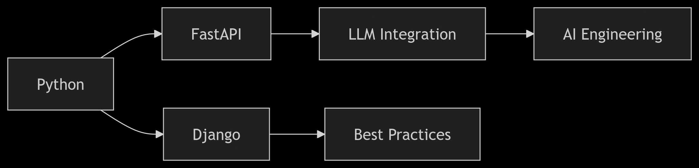

# 🚀 OndaTrain Blog 
## Backend Dev & AI Engineering Hub

¡Bienvenido al repositorio oficial del blog OndaTrain! ✨ Un espacio creado por y para desarrolladores apasionados por el backend, las APIs inteligentes y el poder de Python. 

```python
print("Aquí compartimos conocimiento que transforma líneas de código en soluciones impactantes")
```

## 🧠 ¿Qué encontrarás aquí?

- 🐍 **Python Power**: Tutoriales avanzados de FastAPI, Django y Flask
- 🤖 **LLM Engineering**: Implementaciones prácticas con modelos de lenguaje
- ⚡ **Backend Best Practices**: Desde arquitecturas limpias hasta deployments escalables
- 🔥 **Casos de estudio**: Lecciones de sistemas en producción
- 🛠️ **Testing y deployment de APIs**: Pytest, Docker, CI/CD y más

## 🌟 Featured Content


## 🛠️ Tech Stack del Blog

| Área       | Tecnologías                  |
|------------|------------------------------|
| Backend    | FastAPI, Django, SQLAlchemy  |
| IA         | LangChain, LangGraph, OpenAI |
| Infra      | Docker, Kubernetes           |
| DB         | PostgreSQL, Redis, MongoDB   |
| DevOps     | Pytest, GitHub Actions       |

## 🤝 ¿Quieres colaborar?

¡Nos encantan las PRs! 👩💻👨💻 Si tienes:
- Correcciones técnicas
- Traducciones
- Tutoriales nuevos
- Casos de estudio interesantes

Sigue nuestra [guía de contribución](CONTRIBUTING.md) y hagamos crecer la comunidad juntos.

## 📬 Mantente conectado

Accede al blog en la siguiente dirección:

## 📜 Licencia

El contenido se comparte bajo [Licencia MIT](LICENSE) - Porque creemos en el conocimiento abierto.

---

Hecho con ❤️, `async/await` y demasiado café por [@ondatrain](https://github.com/ondatrain).

¿Listo para el siguiente nivel? ⚡
